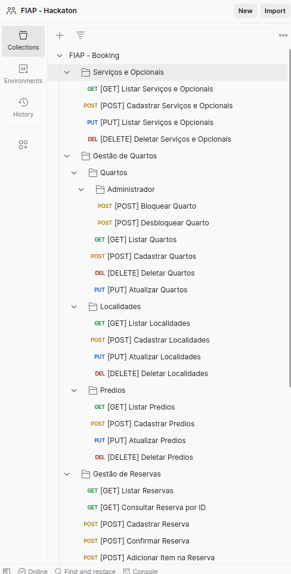

# HACKATHON FIAP - BOOKING

Este projeto é um sistema de gestão de hospitalidade, especificamente um sistema de reservas para hotéis. Ele permite aos usuários agendar, buscar a melhor solução custo-benefício e pré-reservar serviços e opções.

## Features

O sistema é composto por várias APIs:

- 👤**API Clientes**: Gerencia os dados do cliente.
```shell
curl --location 'http://localhost:8080/booking/api/clientes' \
--header 'Content-Type: application/json' \
--data-raw '{
    "nomeCompleto":"Jack Sparrow",
    "dataNascimento": "2023-04-12",
    "cpf": "48464167040",
    "sexo": "MASCULINO",
    "email": "jackzinho_matadordedragao@gmail.com",
    "telefone": "(11) 1234-1234",
    "paisDeOrigem": "Brasil",
    "endereco": "Rua dos alfineiros, 61"
}'
```
- 📒**API Localidade**: Gerencia os dados de localização.
```shell
curl --location 'http://localhost:8080/booking/api/localidades'
```
- 🏨**API Prédio**: Gerencia os dados do prédio.
```shell
curl --location 'http://localhost:8080/booking/api/predios' \
--header 'Content-Type: application/json' \
--data '{
    "nome":"Localidade 2",
    "localidadeId": 1
}'
```
- 😴**API Quarto**: Gerencia os dados do quarto.
```shell
curl --location 'http://localhost:8080/booking/api/quartos'
```
- 📅**API Reserva**: Gerencia os dados de reserva.
```shell
curl --location 'http://localhost:8080/booking/api/reservas' \
--header 'Content-Type: application/json' \
--data '{
  "clienteId": 1,
  "dataEntrada": "2023-05-01",
  "dataSaida": "2023-05-05",
  "quartosIds": [1, 2],
  "servicosOpcionais": ["Jantar","Café da manhã"]
}'
```
- 🍴**API Serviço Opcional**: Gerencia os dados de serviços opcionais.
```shell
curl --location 'http://localhost:8080/booking/api/servicos-opcionais'
```
- 🪒 **API Administrativa de bloqueio/desbloqueio de quartos**: Gerencia os dados de reserva de um quarto administrativamente
```shell
curl --location --request POST 'http://localhost:8080/booking/api/quartos/2/admin/bloquear'
curl --location --request POST 'http://localhost:8080/booking/api/quartos/2/admin/bloquear'
```
Importante: para consultar todas as opções de APIs, favor acessar a collection POSTMAN disponibilizada: 

- [FIAP - Booking.postman_collection.json](src%2Fmain%2Fresources%2FFIAP%20-%20Booking.postman_collection.json)




## Tecnologias e ferramentas utilizadas:

* [Spring initializr]( https://start.spring.io/): Ferramenta para criação de projetos Spring Boot
* [Spring Boot ]( https://spring.io/projects/spring-boot): Framework Web 
* [Spring Boot Starter Web] Dependência para desenvolvimento Web
* [Spring Boot Starter Validation] Dependência para validação de formulários
* [Maven]( https://mvnrepository.com/): Gerenciador de dependências do projeto
* [JPA Repository] Gerenciador de interação entre camadas do projeto
* [Lombock] Dependência para requisições HTTP
* [Postman](https://www.postman.com/): Ferramenta para teste de requisições HTTP
* [Open Api - Swagger] Dependência para gerar interface amigável para testes
* [H2] Banco de dados em memória


## Desafios


Optamos por adotar uma abordagem monolítica para o desenvolvimento de nossa aplicação, visando otimizar o tempo e concentrar esforços em outras áreas do projeto.

Decidimos alcançar uma cobertura de testes de 50% para refletir o conhecimento adquirido até o momento, permitindo-nos avançar para a próxima fase do projeto.

Durante o desenvolvimento, surgiram desafios relacionados à interpretação das regras de negócio, incluindo questões sobre os limites do escopo do projeto:

A escolha do banco de dados: Optamos por utilizar o H2, uma solução leve e eficiente para nossas necessidades.
Testes e simulação de requisições HTTP: Para testar nossas APIs, decidimos utilizar ferramentas como o Swagger UI e o Postman, facilitando a criação e execução de testes automatizados.
Esses foram alguns dos aspectos considerados pela equipe durante a fase inicial do projeto. A partir dessas definições, realizamos reuniões de alinhamento para planejar e coordenar nossas ações, garantindo uma execução eficiente e coerente com nossos objetivos.

## Consultando a Documentação da API
Acessa o arquivo swagger da aplicação pelo link: [api-docs.json](src%2Fmain%2Fresources%2Fapi-docs.json)
Basta colar o documento no site: [Swagger Editor](https://editor.swagger.io/)

Você pode também pode consultar a documentação da API em run-time. Para isso, siga os passos abaixo:

Certifique-se de que a aplicação está em execução.
Abra um navegador web e navegue até http://localhost:8080/booking/swagger-ui.html.
Isso abrirá a interface do Swagger, onde você poderá explorar todos os endpoints disponíveis, seus parâmetros e respostas.

## Método de utilização da(s) API(s):
## Arquivo do Postman
Para facilitar o teste e a utilização da API, disponibilizamos um arquivo do Postman com todas as requisições pré-configuradas. Você pode encontrar o arquivo em:

```shell
./fiap-hackathon-booking/src/main/resources/FIAP - Booking.postman_collection.json
```

Basta importar esse arquivo para o seu ambiente do Postman e começar a usar as requisições imediatamente.

## Diagrama de tabelas:


## Coverage dos testes:


